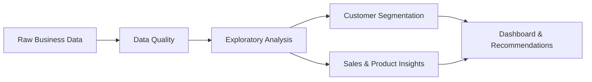

### Turning operational data into clear insights and practical business improvements

## 👋 About Me

I am transitioning from **operations management into data and process analytics** through a vocational retraining program (Umschulung) and practical experience at **NADOOIT**. I combine an **MBA in Operations Management**, a **Six Sigma Green Belt**, and technical analytics skills to examine business processes, find improvement opportunities, and communicate evidence-based recommendations.

- 📊 Building portfolio projects around sales, customers, and operational performance
- 🔍 Interested in data quality, process improvement, segmentation, and forecasting
- 🌱 Developing practical experience with Python, SQL, databases, and machine learning
- 🤝 Open to analytics collaborations and beginner-friendly open-source contributions

## 🛠️ Analytics Toolkit

## 🚀 Featured Analytics Work

### 🛒 [E-commerce Sales Analysis with Python](https://github.com/Khadija-de/ecommerce-sales-analysis-python.)

An end-to-end analysis of UK retail transactions that turns raw sales data into insights for planning, customer retention, and decision-making.

| Business result | Finding |
| --- | ---: |
| Cleaned revenue analyzed | **£8.9M** |
| Clean transaction rows | **397,884** |
| Customers analyzed | **4,338** |
| Revenue from repeat customers | **93.1%** |

**What the project demonstrates:** data cleaning, quality checks, exploratory analysis, seasonality, customer retention, business recommendations, reusable Python code, and an equivalent SQL analysis.

## 🌍 Open-Source Contribution

Contributed a documentation improvement to **[skrub](https://github.com/skrub-data/skrub)**, a Python library for machine learning with dataframes. The contribution updated a `ToFloat` example to use the library's public API and was reviewed and merged by the maintainers.

## 🗺️ Current Portfolio Roadmap

My next portfolio milestones are **RFM customer segmentation**, **product-category analysis**, and an **interactive sales dashboard**.

## 📈 GitHub Activity

## 🎯 Career Direction

I am working toward a role in **Data and Process Analytics** where I can combine operations knowledge, Six Sigma methods, and technical analysis to improve processes and support better business decisions.

Outside analytics, I enjoy dancing, staying fit, and learning through practical experience.

### Let’s connect around data analytics, process improvement, and open source

